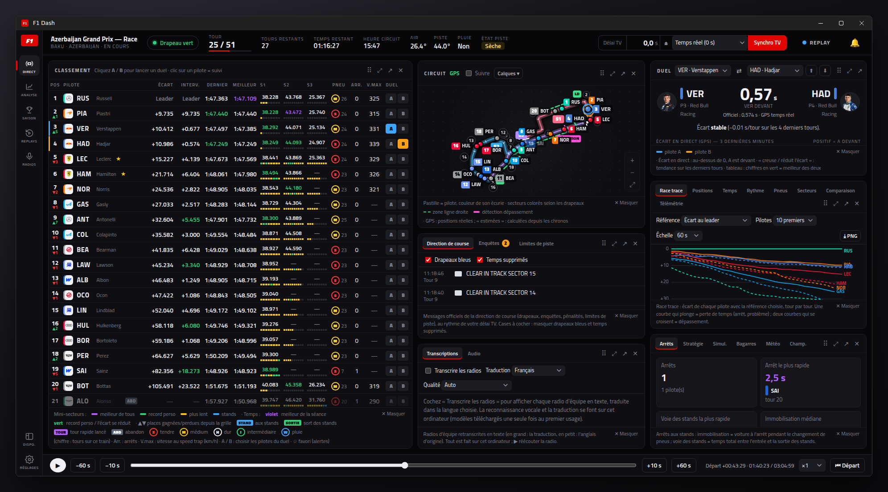
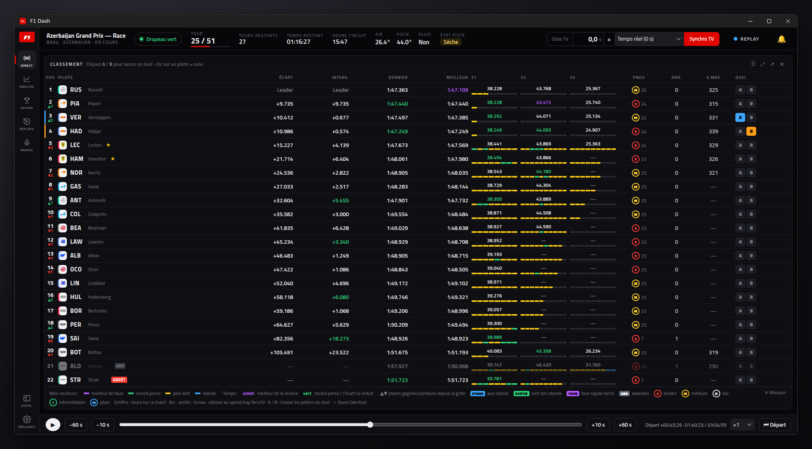
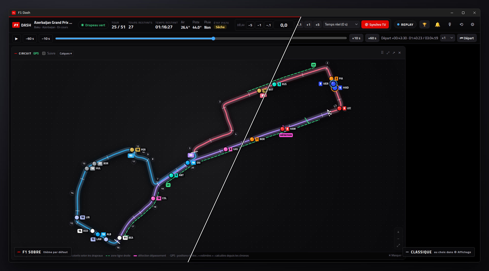
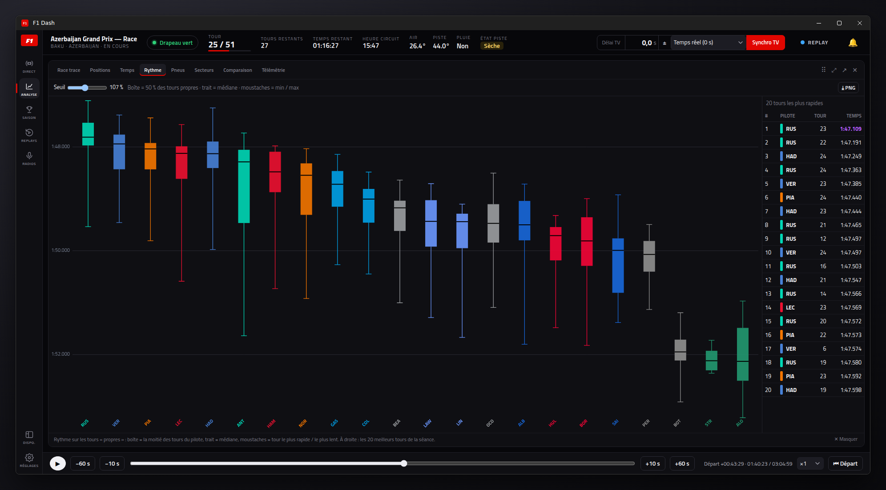
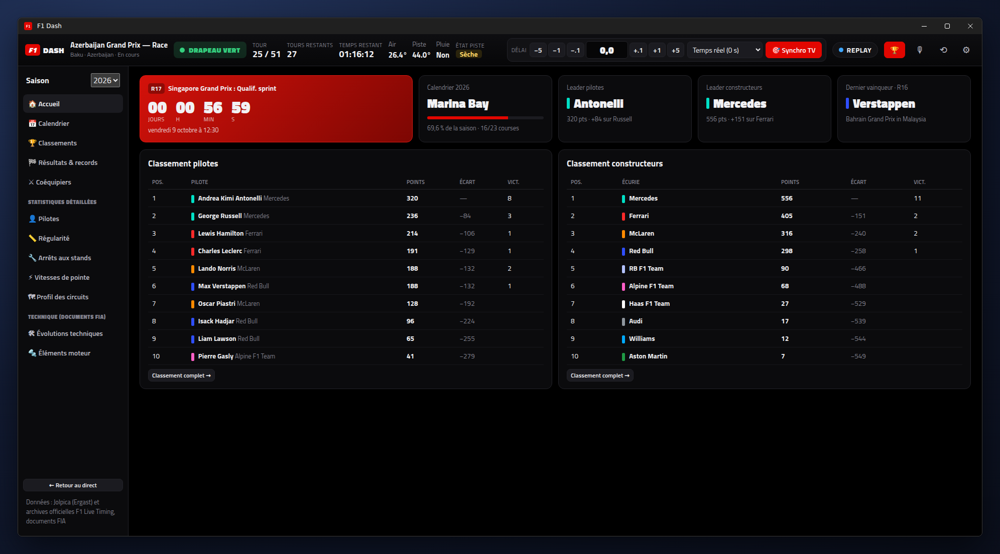
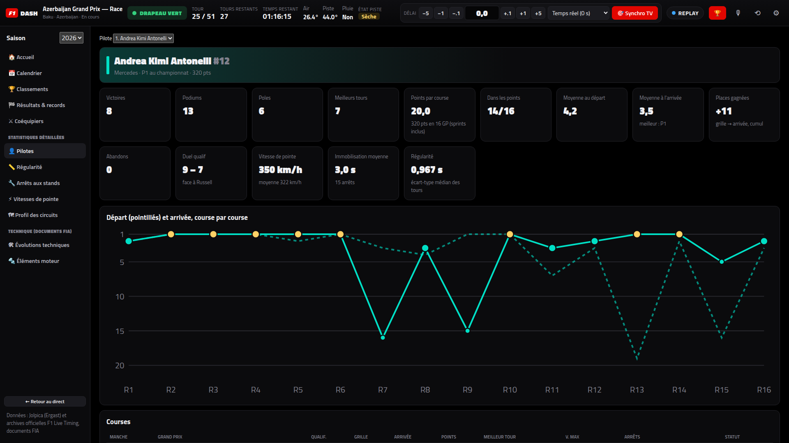
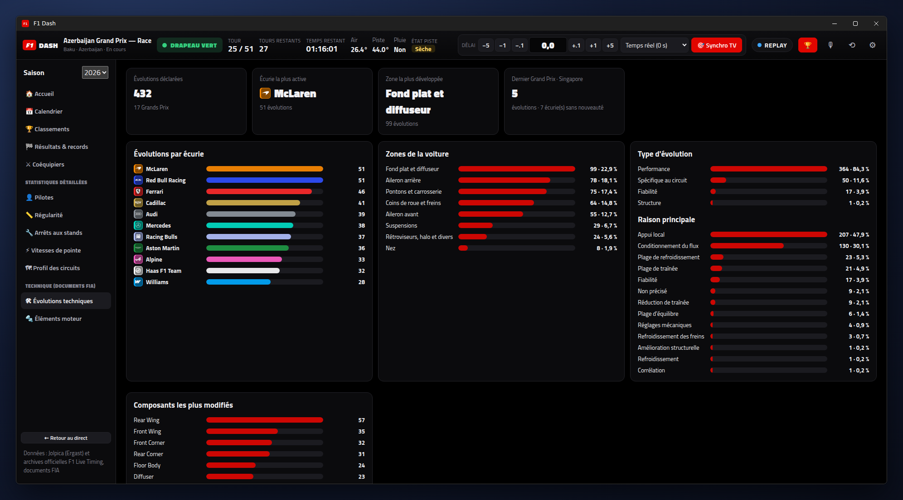
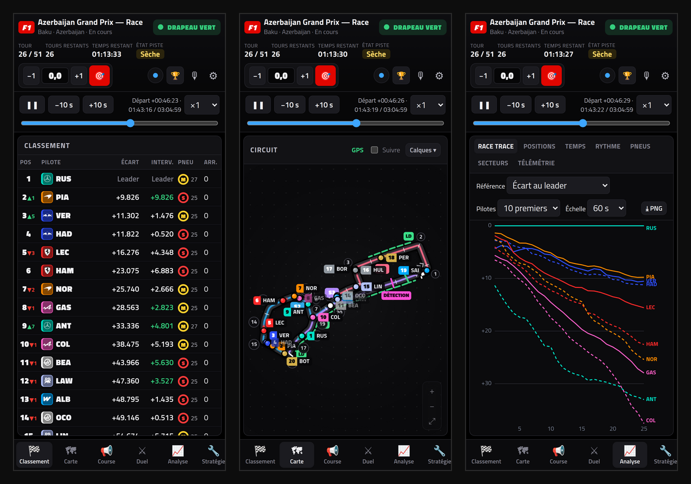

# 🏁 F1 Dash

Dashboard **Formule 1 en direct** pour suivre chaque Grand Prix sur votre ordinateur, **calé sur le délai de votre diffusion TV** (Canal+, myCANAL…). Windows, macOS et Linux.

## ✨ En bref

- **Classement en direct** : écarts, secteurs et mini-secteurs, pneus, arrêts, vitesse de pointe, logos des écuries ; en qualif, limite d'élimination et temps à battre.
- **Carte du circuit** : toutes les voitures en mouvement (GPS), drapeaux par secteur, safety car, zones ligne droite et détection.
- **Synchro TV** : tout (chronos, carte, drapeaux, radios, alertes) est retardé pour coller à votre image, **sans spoiler**.
- **Duels, bagarres et simulateur d'arrêt** : écart en temps réel, tendance, « s'il s'arrête maintenant, il ressort P8 ».
- **Analyse** : race trace, positions, temps au tour, rythme, pneus, secteurs, télémétrie.
- **Direction de course et enquêtes**, avec les documents officiels de la FIA.
- **Radios d'équipe** retranscrites et traduites en français, sur votre ordinateur.
- **Commentaires F1 TV Pro** ou radio de votre choix, synchronisés sur le dashboard.
- **Espace Saison** : calendrier, classements, statistiques par pilote, régularité, arrêts, vitesses, profils des circuits, évolutions techniques et éléments moteur (documents FIA).
- **Replays** de toutes les sessions archivées, disposition libre des panneaux, second écran.
- **Sur votre téléphone ou tablette** : l'ordinateur affiche un QR code ; scannez-le pour retrouver le dashboard sur le réseau Wi-Fi de la maison, calé sur le même délai TV.

| | |
|---|---|
|  |  |
|  |  |
|  |  |

## 🚀 Installation

Téléchargez la dernière version sur la page **[Releases](https://github.com/benjamin-ct/F1_Dash/releases/latest)** :

| Système | Fichier | Remarque |
|---|---|---|
| **Windows** | `…-x64-win.exe` (installateur) ou `…-portable.exe` | Avertissement SmartScreen : « Informations complémentaires » → « Exécuter quand même ». |
| **macOS** (Apple Silicon / Intel) | `…-mac-arm64.dmg` / `…-mac-x64.dmg` | Glissez F1 Dash dans Applications. L'appli n'est pas certifiée par Apple : au premier lancement, clic droit → « Ouvrir » (si macOS la dit endommagée : `xattr -cr "/Applications/F1 Dash.app"` dans le Terminal). |
| **Linux** (x64 / ARM) | `…-linux-x86_64.AppImage` / `…-linux-arm64.AppImage`, ou `…-linux-amd64.deb` | AppImage : `chmod +x` puis lancez-la. Paquet : `sudo apt install ./F1-Dash-…deb`. |

L'application **se met à jour toute seule** (sauf le paquet `.deb`).

**Sans installer l'application** : avec [Node.js](https://nodejs.org) 22 ou plus, téléchargez ce dépôt puis lancez `Lancer F1 Dash.bat` (Windows) ou `./start.sh` (macOS / Linux), ou `npm install && npm start`, et ouvrez <http://localhost:3000>.

## ⏱ Se caler sur la TV

Le flux de chronométrage arrive **avant** l'image TV : le dashboard vous montre la course telle qu'elle était il y a N secondes.

1. Lancez le dashboard quelques minutes avant la session.
2. Cliquez sur **🎯 Synchro TV** (touche `S`) et, au moment où vous voyez un repère sur votre TV (changement de tour, drapeau…), cliquez **« Je le vois ! »**.
3. Enregistrez ce délai en préréglage (« Canal+ salon »…) pour la prochaine fois.

Ajustement fin : `←` `→` ±1 s, `Maj` ±5 s, `Alt` ±0,1 s.

## 📡 Avec un abonnement F1 TV (optionnel)

Tout fonctionne sans compte. Avec F1 TV, connectez-vous dans ⚙ Réglages pour avoir **les positions GPS exactes et la télémétrie** en direct (sinon les positions sont estimées). **F1 TV Pro** donne en plus les **commentaires en direct** (bouton 🎙).

## 📱 Sur téléphone ou tablette

Sur l'ordinateur : ⚙ Réglages → Application → **« Autoriser l'accès depuis le réseau local »**, puis scannez le QR code avec le téléphone (même Wi-Fi). Le téléphone reprend le délai TV de l'ordinateur et affiche un panneau à la fois, avec des onglets en bas. Pour l'avoir comme une appli : « Ajouter à l'écran d'accueil ». Détails dans le [guide](docs/GUIDE.md#-sur-téléphone-ou-tablette).

## ⌨ Raccourcis

`S` synchro TV · `←` `→` délai (± `Maj` / `Alt`) · `Espace` pause en replay · `M` couper les alertes · `C` couper les commentaires · `Échap` réduire le panneau agrandi

## 📖 Pour aller plus loin

Le **[guide complet](docs/GUIDE.md)** détaille chaque panneau, l'espace Saison, les alertes, les commentaires et la radio, la disposition et le second écran, les replays et enregistrements, les options de lancement et le fonctionnement interne.

Tests : `npm test`.

> Projet non officiel, sans lien avec la Formula 1, la FIA ou Canal+. Les données proviennent du flux public F1 Live Timing et sont destinées à un usage personnel.

